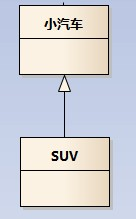
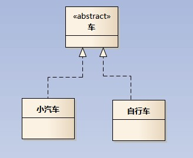
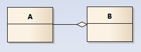
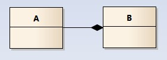
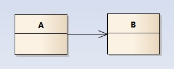
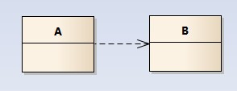

## UML类图
### 类的继承
继承非抽象类：泛化（空心箭头实线）
继承抽象类：实现（空心箭头虚线）

  
  <figcaption>SUV 泛化 小汽车</figcaption>

  
  <figcaption>自行车、小汽车 实现 抽象类-车</figcaption>

### 类的聚合
A聚合到B上，但B消失时，A不一定消失，空心菱形实线

  
  <figcaption>例如，部门和员工，部门消失了，员工仍然存在</figcaption>

### 类的组合
A组合到B上，B消失时，A也消失，实心菱形实线

  
  <figcaption>例如，人和心脏，心脏消失了，人也就不存在了</figcaption>

### 类的关联与依赖
关联关系：实线箭头（如果无箭头，表示两者相互关联）[通常以成员变量的形式存在]
依赖关系：虚线箭头[描述一个对象在运行期间会用到另一个对象的关系]

  
  <figcaption>关联关系</figcaption>

  
  <figcaption>依赖关系</figcaption>

