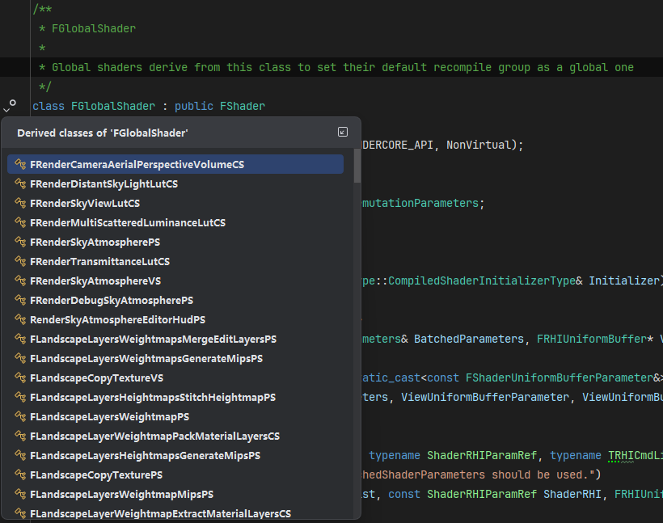
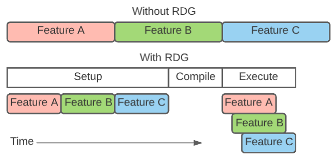
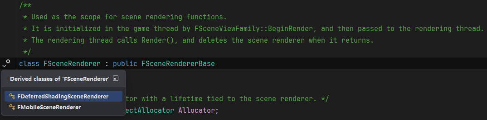
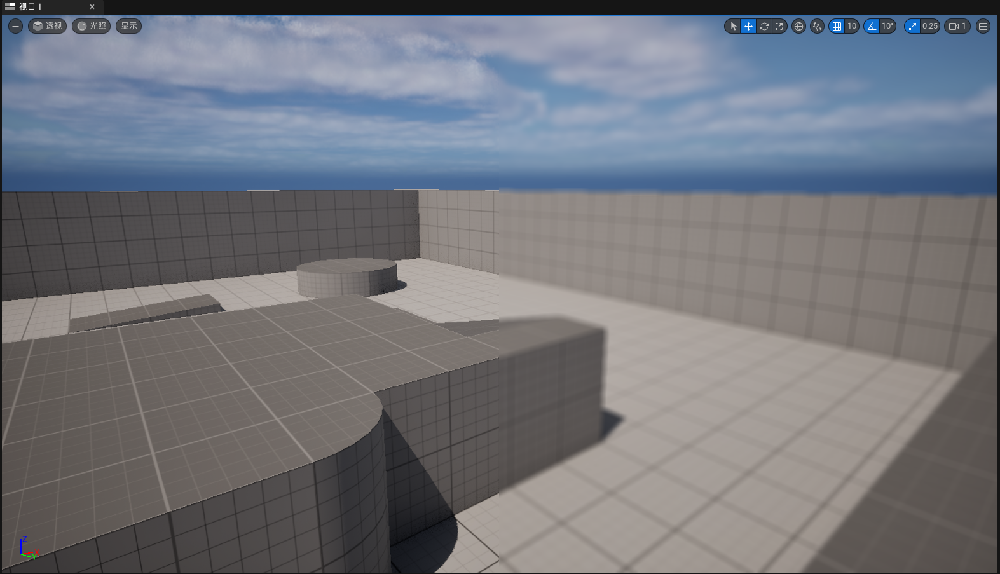

## 1.在虚幻引擎5.4中添加后处理Pass
最近快校招入职了，然而面试的时候全靠C++和图形学面的，有点子害怕入职后UE啥都不懂，于是先从最简单的：也就是如何添加一个后处理Pass开始学起。
看了不少文章，但这些文章要么不太适合之前对UE不太熟悉的人；要么就是直接上代码，没有过多的解释；还有一些文章在原理部分讲的较为深入，但缺少了实践部分。
因此，我把自己如何添加一个后处理Pass的过程完全记录下来，并在每一小节列出相关的参考资料，以便后续查阅。
### 1.1一些前置知识
虚幻中相关概念和源码异常繁杂，对于添加后处理Pass这一任务，可以暂时略过RHI等部分，直接考虑添加GlobalShader和Pass。
#### 1.1.1 FGlobalShader
参考资料：
- [0向往0大佬的 <<剖析虚幻渲染体系（08）- Shader体系>> ](https://www.cnblogs.com/timlly/p/15092257.html#8431-%E6%96%B0%E5%A2%9Eglobal-shader)
- [Unreal官方文档 Adding Global Shaders to Unreal Engine](https://dev.epicgames.com/documentation/en-us/unreal-engine/adding-global-shaders-to-unreal-engine)
- [Unreal官方文档 Shader Development](https://dev.epicgames.com/documentation/en-us/unreal-engine/shader-development-in-unreal-engine)


根据官方文档的描述， ```FGlobalShader```是在fixed geometry（如全屏四边形等）上操作的着色器，它不与材质交互并且在内存中只有唯一的实例。与之相对应的概念是```FMaterialShader```，顾名思义，它是用于与材质交互的着色器。在源码中，我们有相当多的子类继承了```FGlobalShader```:
<div style="text-align: center;">
  
  <figcaption>FGlobalShader的子类</figcaption>
</div>

可以看到，这些子类包含了一些地形、大气，Sky等方面的Shader代码。
因此，如果我们要添加一个后处理Pass的话，类似于源码，==我们需要创建一个继承自FGlobalShader的子类，然后实现其中必要的部分。==

#### 1.1.2 RDG
参考资料：
- [Unreal官方文档 Render Dependency Graph](https://dev.epicgames.com/documentation/en-us/unreal-engine/render-dependency-graph-in-unreal-engine)
- [0向往0大佬的 <<剖析虚幻渲染体系（11）- RDG >> ](https://www.cnblogs.com/timlly/p/15217090.html#112-rdg%E5%9F%BA%E7%A1%80)
- [知乎Lnusie1  <<Unreal引擎RenderGraph源码剖析>>](https://zhuanlan.zhihu.com/p/702354878)

渲染依赖图（Render Dependency Graph）RDG，把要编译和执行的渲染命令记录到图数据结构中。RDG通过自动化易出错的操作来简化高级渲染代码，并遍历依赖图以优化内存使用并在CPU和GPU上并行渲染通道（来自官方文档的描述）。从官方文档的图中可以更直观地理解RDG：
<div style="text-align: center;">
  
  <figcaption>RDG</figcaption>
</div>

这个图比较清楚地展示了RDG的作用，在没有RDG时，各个Feature之间是手动管理并且立即执行的；在有RDG时，开发者只要设置和实现各个Feature，并Setup。RDG会自动管理Feature之间的依赖关系，并自动执行各个Feature，这种执行还可能是并行的。

此外，在RDG系统中，基本上对所有的RHI资源进行了封装和包裹，以便进一步控制、管理RHI资源。

```FRDGBuilder```是RDG体系的核心，后续开发中会频繁地使用该类。


### 1.2 添加一个PS着色器并在末尾添加后处理效果

#### 1.2.1 Step1 添加自己的PS着色器
有了对于```FGlobalShader```的基本了解（建议阅读[1.1.1节](#111-fglobalshader)以及其中提到的参考资料），我们就可以开始添加后处理Pass了。
为了简单起见，我们可以参考已有的Unreal代码，这里选择的是```FGlobalShader```的子类```FScreenSpaceShadowsUpsamplePS```：

```cpp
// Engine/Source/Runtime/Renderer/Private/Shadows/ScreenSpaceShadows.cpp
class FScreenSpaceShadowsUpsamplePS : public FGlobalShader
{
	DECLARE_GLOBAL_SHADER(FScreenSpaceShadowsUpsamplePS);
	SHADER_USE_PARAMETER_STRUCT(FScreenSpaceShadowsUpsamplePS, FGlobalShader);

	BEGIN_SHADER_PARAMETER_STRUCT(FParameters, )
		SHADER_PARAMETER_STRUCT_INCLUDE(FSceneTextureShaderParameters, SceneTextures)
		SHADER_PARAMETER_STRUCT_REF(FViewUniformShaderParameters, View)
		SHADER_PARAMETER_RDG_TEXTURE(Texture2D, ShadowFactorsTexture)
		SHADER_PARAMETER_SAMPLER(SamplerState, ShadowFactorsSampler)
		SHADER_PARAMETER(FIntRect, ScissorRectMinAndSize)
		SHADER_PARAMETER(float, OneOverDownsampleFactor)
	END_SHADER_PARAMETER_STRUCT()

	class FUpsample : SHADER_PERMUTATION_BOOL("SHADOW_FACTORS_UPSAMPLE_REQUIRED");
	using FPermutationDomain = TShaderPermutationDomain<FUpsample>;

	static bool ShouldCompilePermutation(const FGlobalShaderPermutationParameters& Parameters)
	{
		return true;
	}

	static void ModifyCompilationEnvironment(const FGlobalShaderPermutationParameters& Parameters, FShaderCompilerEnvironment& OutEnvironment)
	{
		OutEnvironment.SetDefine(TEXT("UPSAMPLE_PASS"), 1);
		OutEnvironment.SetDefine(TEXT("FORCE_DEPTH_TEXTURE_READS"), 1);
	}
};

IMPLEMENT_GLOBAL_SHADER(FScreenSpaceShadowsUpsamplePS, "/Engine/Private/ScreenSpaceShadows.usf", "ScreenSpaceShadowsUpsamplePS", SF_Pixel);

BEGIN_SHADER_PARAMETER_STRUCT(FScreenSpaceShadowsUpsample, )
	SHADER_PARAMETER_STRUCT_INCLUDE(FScreenSpaceShadowsUpsamplePS::FParameters, PS)
	RENDER_TARGET_BINDING_SLOTS()
END_SHADER_PARAMETER_STRUCT()
```

其中，对于Shader变体Permutation的部分暂时不考虑，于是可以在Renderer/Prevate下新增一个MyPostRendering.cpp文件, 照葫芦画瓢可以写出如下代码：
```cpp
// Engine/Source/Runtime/Renderer/Private/MyPostRendering.cpp
class FMyPostRenderingPS : public FGlobalShader
{
	DECLARE_GLOBAL_SHADER(FMyPostRenderingPS);
	SHADER_USE_PARAMETER_STRUCT(FMyPostRenderingPS, FGlobalShader);

	BEGIN_SHADER_PARAMETER_STRUCT(FParameters, )
		SHADER_PARAMETER_STRUCT_REF(FViewUniformShaderParameters, View)
		SHADER_PARAMETER_RDG_TEXTURE(Texture2D, SceneColorTexture)
		SHADER_PARAMETER_SAMPLER(SamplerState, SceneColorSampler)
	END_SHADER_PARAMETER_STRUCT()
};

IMPLEMENT_GLOBAL_SHADER(FMyPostRenderingPS, "/Engine/Private/MyPostRendering.usf", "MainPS", SF_Pixel);

BEGIN_SHADER_PARAMETER_STRUCT(FMyPostRenderingParameter, )
	SHADER_PARAMETER_STRUCT_INCLUDE(FMyPostRenderingPS::FParameters, PS)
	RENDER_TARGET_BINDING_SLOTS()
END_SHADER_PARAMETER_STRUCT()
```
代码中的宏来自```Engine/Source/Runtime/RenderCore/Public/ShaderParameterMacros.h```, 用于创建Shader参数结构体，并自动生成一些辅助函数。C++侧创建的Shader还需要有对应的usf文件，并要指定入口函数，名称要和着色器中对应。

```MyPostRendering.cpp```需用的头文件同样可参考```ScreenSpaceShadows.cpp```，这里我们比较简单的：
```cpp
// Engine/Source/Runtime/Renderer/Private/MyPostRendering.cpp
#include "MyPostRendering.h"
#include "SceneRendering.h"
#include "PixelShaderUtils.h"
```

这里我们创建的是```MyPostRendering.usf```文件放在路径```Engine/Shaders/Private/MyPostRendering.usf```下。这里注意使用```IMPLEMENT_GLOBAL_SHADER```填入的路径是```"/Engine/Private/MyPostRendering.usf"```。
```MyPostRendering.usf```的内容如下，根据传入的全屏纹理的UV.x位置来决定是不是模糊，最后的效果就是一个简单的半屏模糊。
```cpp
// Engine/Shaders/Private/MyPostRendering.usf
#include "Common.ush"
Texture2D SceneColorTexture;
SamplerState SceneColorSampler;

#define MPR_BLUR_RADIUS 6

void MainPS(
noperspective float4 UVAndScreenPos: TEXCOORD0,
float4 SvPosition:SV_POSITION,
out float4 OutColor:SV_TARGET0)
{
	float2 UV = UVAndScreenPos.xy;
	float3 Result = float3(0.,0.,0.);

	uint Width, Height;
	SceneColorTexture.GetDimensions(Width, Height);
	float2 TexSize = 1.0f / float2(Width, Height);

	for (int i = -MPR_BLUR_RADIUS; i < MPR_BLUR_RADIUS; ++i)
	{
		for ( int j = -MPR_BLUR_RADIUS; j < MPR_BLUR_RADIUS; ++j)
		{
			float2 SampledUV = UV + (float2(i, j) * TexSize);
			Result += Texture2DSample(SceneColorTexture, SceneColorSampler, SampledUV).rgb;
		}
	}
	
	float3 BlurResult = Result / (float(MPR_BLUR_RADIUS) * float(MPR_BLUR_RADIUS) * 4.0f);
	float3 OriginalColor = Texture2DSample(SceneColorTexture, SceneColorSampler, UV).rgb;

	OutColor = float4(lerp(OriginalColor, BlurResult, step(0.5, UV.x)), 1.0);
}
```


至此，Shader部分添加完成，下一步就是在合适的地方调用这个Shader，传入参数并渲染。


#### 1.2.2 Step2 添加渲染调用
熟悉渲染或用过任意一种图形API的小伙伴们想必对延迟渲染不陌生，虚幻中也实现了延迟管线，查看```FSceneRenderer```的子类：
<div style="text-align: center;">
  
  <figcaption>FSceneRenderer的Derived classes</figcaption>
</div>

可以发现，虚幻中实现了```FDeferredShadingSceneRenderer```和```FMobileSceneRenderer```，后者从类名上就可以看出是移动平台使用的, 本小节先暂时忽略对```FSceneRenderer```的相关内容介绍（这部分内容将在另开章节进行说明），我们只要知道，桌面平台的渲染全部在```FDeferredShadingSceneRenderer```中的```virtual void Render(FRDGBuilder& GraphBuilder) override;```完成即可。

所以我们要做的就是在这个```Render```函数中调用我们的内容。于是我们在```MyPostRendering.h```中创建如下内容和函数声明：
```cpp
#pragma once
#include "CoreMinimal.h"
#include "RendererInterface.h"

void RenderMyPostEffect(FRDGBuilder & GraphBuilder, const FViewInfo& View, FRDGTextureRef ViewFamilyTexture);
```
并在```MyPostRendering.cpp```中实现这个函数：
```cpp
void RenderMyPostEffect(FRDGBuilder & GraphBuilder, const FViewInfo& View, FRDGTextureRef ViewFamilyTexture)
{
	FRDGTextureRef CopiedTexture = GraphBuilder.CreateTexture(ViewFamilyTexture->Desc, TEXT("CopiedTexture"));
	AddCopyTexturePass(GraphBuilder, ViewFamilyTexture, CopiedTexture);

	TShaderMapRef<FMyPostRenderingPS> PixelShader(View.ShaderMap);
	FMyPostRenderingParameter *PassParameters = GraphBuilder.AllocParameters<FMyPostRenderingParameter>();
	PassParameters->PS.View = View.ViewUniformBuffer;
	PassParameters->PS.SceneColorSampler = TStaticSamplerState<SF_Point, AM_Clamp, AM_Clamp, AM_Clamp>::GetRHI();
	PassParameters->PS.SceneColorTexture = CopiedTexture;
	PassParameters->RenderTargets[0] = FRenderTargetBinding(ViewFamilyTexture, ERenderTargetLoadAction::ENoAction);

	const FScreenPassTextureViewport Viewport(ViewFamilyTexture);
	const TShaderMapRef<FScreenPassVS> VertexShader(GetGlobalShaderMap(View.GetFeatureLevel()));
	FRHIBlendState* BlendState = FScreenPassPipelineState::FDefaultBlendState::GetRHI();
	FRHIDepthStencilState* DepthStencilState = FScreenPassPipelineState::FDefaultDepthStencilState::GetRHI();

	
	ClearUnusedGraphResources(PixelShader, &PassParameters->PS);
	
	const FScreenPassPipelineState PipelineState(VertexShader, PixelShader, BlendState, DepthStencilState);
	
	GraphBuilder.AddPass(
		RDG_EVENT_NAME("MyPostRendering"),
		PassParameters,
		ERDGPassFlags::Raster,
		[ PipelineState, PixelShader, Viewport,  PassParameters](FRHICommandList& RHICmdList)
	{
		DrawScreenPass(RHICmdList, FScreenPassViewInfo(), Viewport, Viewport, PipelineState, EScreenPassDrawFlags::None, [&](FRHICommandList&)
		{
			SetShaderParameters(RHICmdList, PixelShader, PixelShader.GetPixelShader(), PassParameters->PS);
		});
	});
}
```

最后在```FDeferredShadingSceneRenderer```的```Render```函数中调用我们添加的渲染函数：
```cpp
// Engine/Source/Runtime/Renderer/Private/DeferredShadingSceneRenderer.cpp

    // 增加的部分
    if (ViewFamily.bResolveScene && ViewFamilyTexture)
    {
        for (int32_t i = 0; i < Views.Num(); ++i)
        {
            const FViewInfo& View = Views[i];
            RenderMyPostEffect(GraphBuilder, View, ViewFamilyTexture);
        }
    }

		
    // After AddPostProcessingPasses in case of Lumen Visualizations writing to feedback
    FinishGatheringLumenSurfaceCacheFeedback(GraphBuilder, Views[0], LumenFrameTemporaries);
```

最后的效果如下：

<div style="text-align: center;">
  
  <figcaption>最终效果</figcaption>
</div>