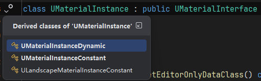
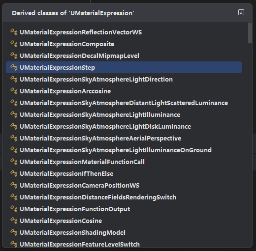
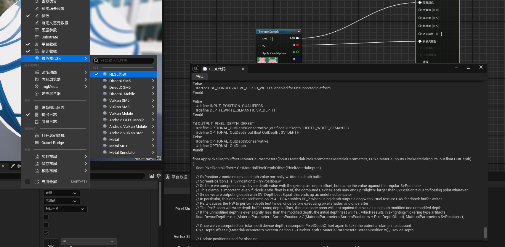
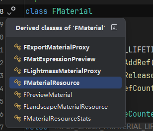
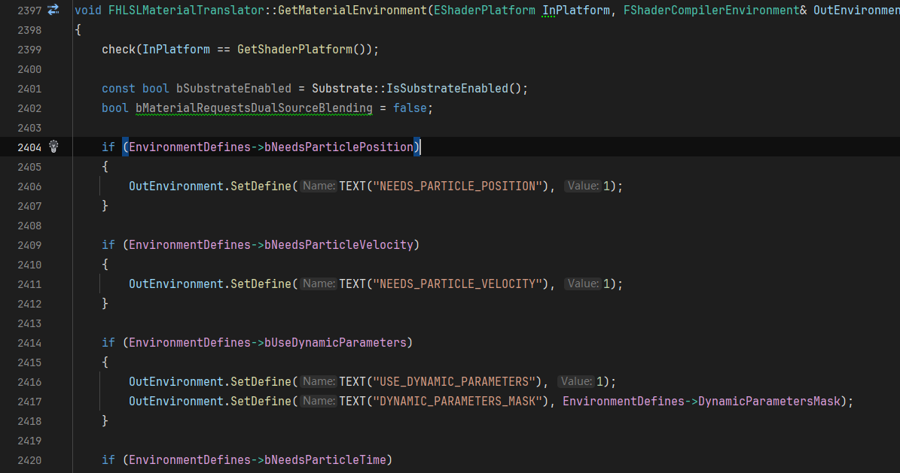

## 材质基础概率和原理

参考资料：
- [0向往0大佬的 <<剖析虚幻渲染体系（09）- 材质体系>> ](https://www.cnblogs.com/timlly/p/15109132.html)
- [虚幻4渲染编程(Shader篇)【第二十三卷：MaterialShaderSystem】](https://zhuanlan.zhihu.com/p/139984908)
- [Unreal官方文档 essential-unreal-engine-material-concepts](https://dev.epicgames.com/documentation/en-us/unreal-engine/essential-unreal-engine-material-concepts)
- [Unreal社区 How the Unreal Engine Translates a Material Graph to HLSL](https://dev.epicgames.com/community/learning/knowledge-base/0qGY/how-the-unreal-engine-translates-a-material-graph-to-hlsl)


### 1.UMaterial和UMaterialInstance
UMaterial 是 Unreal Engine 中的一个类，用于定义材质的属性和行为。它对应于Asset中的.uasset文件，该文件包含了材质的属性和参数。
>A Material is an asset which can be applied to a mesh to control the visual look of the scene. When light from the scene hits the surface, the shading model of the material is used to calculate how that light interacts with the surface.
UMaterialInstance 是 UMaterial 的实例，用于在场景中应用材质。它包含了 UMaterial 的属性和参数，以及一些额外的属性，如材质的实例化参数和材质的实例化状态。

UMaterialInstance中指定了父材质，即UMaterial，通过Parent属性来指定。对应于我们在Content使用时的材质实例化。
```cpp
	/** Parent material. */
	UPROPERTY(EditAnywhere, BlueprintReadOnly, Category=MaterialInstance, AssetRegistrySearchable)
	TObjectPtr<class UMaterialInterface> Parent;
```
UMaterialInstance通常不被直接创建，是通过它的两个子类UMaterialInstanceConstant和UMaterialInstanceDynamic来创建的。

UMaterialInstanceConstant 是 UMaterialInstance 的一个子类，用于创建静态材质实例，即材质实例的参数在创建后不能被修改。UMaterialInstanceDynamic 是 UMaterialInstance 的另一个子类，用于创建动态材质实例，即材质实例的参数可以在运行时被修改。


### 2.材质的数据传递、更新、渲染逻辑

(待补充)

### 3.材质编译
材质编译的主要参与类首先是UMaterialExpression，该类包含了GraphNode，Material，以及Function。
```cpp
CLASS(abstract, Optional, BlueprintType, Config=MaterialExpressions, hidecategories=Object, MinimalAPI)
class UMaterialExpression : public UObject
{
	GENERATED_UCLASS_BODY()

	static constexpr int32 CompileExecutionOutputIndex = -2;

	UPROPERTY(BlueprintReadWrite, Category = MaterialEditing)
	int32 MaterialExpressionEditorX;

	UPROPERTY(BlueprintReadWrite, Category = MaterialEditing)
	int32 MaterialExpressionEditorY;

	/** Expression's Graph representation */
	UPROPERTY(transient)
	TObjectPtr<UEdGraphNode>	GraphNode;

	/** If exists, expresssion containing this expression within its subgraph. */
	UPROPERTY()
	TObjectPtr<UMaterialExpression> SubgraphExpression;

	/** Text of last error for this expression */
	FString LastErrorText;

	/** GUID to uniquely identify this node, to help the tutorials out */
	UPROPERTY()
	FGuid MaterialExpressionGuid;

	/** 
	 * The material that this expression is currently being compiled in.  
	 * This is not necessarily the object which owns this expression, for example a preview material compiling a material function's expressions.
	 */
	UPROPERTY()
	TObjectPtr<class UMaterial> Material;

	/** 
	 * The material function that this expression is being used with, if any.
	 * This will be NULL if the expression belongs to a function that is currently being edited, 
	 */
	UPROPERTY()
	TObjectPtr<class UMaterialFunction> Function;

	/** A description that level designers can add (shows in the material editor UI). */
	UPROPERTY(EditAnywhere, Category=MaterialExpression, meta=(MultiLine=true, DisplayAfter = "SortPriority"))
	FString Desc;

    (......)
};
```

具体的逻辑在UMaterialExpression的子类中实现。


这里可以看一下一个简单的abs实现,一共重写三个函数：
```cpp
// UE_5.6\Engine\Source\Runtime\Engine\Public\Materials\MaterialExpressionAbs.h
UCLASS(MinimalAPI, collapsecategories, hidecategories=Object)
class UMaterialExpressionAbs : public UMaterialExpression
{
	GENERATED_BODY()

public:

	/** Link to the input expression to be evaluated */
	UPROPERTY()
	FExpressionInput Input;


	//~ Begin UMaterialExpression Interface
#if WITH_EDITOR
	virtual void Build(MIR::FEmitter& Emitter) override;
	virtual int32 Compile(class FMaterialCompiler* Compiler, int32 OutputIndex) override;
	virtual void GetCaption(TArray<FString>& OutCaptions) const override;
#endif
	//~ End UMaterialExpression Interface

};
```

```cpp
// UE_5.6\Engine\Source\Runtime\Engine\Private\Materials\MaterialExpressions.cpp
#if WITH_EDITOR
int32 UMaterialExpressionAbs::Compile( FMaterialCompiler* Compiler, int32 OutputIndex)
{
	int32 Result=INDEX_NONE;

	if( !Input.GetTracedInput().Expression )
	{
		// an input expression must exist
		Result = Compiler->Errorf( TEXT("Missing Abs input") );
	}
	else
	{
		// evaluate the input expression first and use that as
		// the parameter for the Abs expression
		Result = Compiler->Abs( Input.Compile(Compiler) );
	}

	return Result;
}

void UMaterialExpressionAbs::GetCaption(TArray<FString>& OutCaptions) const
{
	OutCaptions.Add(TEXT("Abs"));
}
#endif // WITH_EDITOR
```

而Compile调用的abs函数其实是虚函数，其由子类实现并翻译为HLSL代码。例如Abs：
```cpp
// UE_5.6\Engine\Source\Runtime\Engine\Private\Materials\HLSLMaterialTranslator.cpp

/**
* Creates the new shader code chunk needed for the Abs expression
*
* @param	X - Index to the FMaterialCompiler::CodeChunk entry for the input expression
* @return	Index to the new FMaterialCompiler::CodeChunk entry for this expression
*/
int32 FHLSLMaterialTranslator::Abs(int32 X)
{
	if (X == INDEX_NONE)
	{
		return INDEX_NONE;
	}

	if (GetParameterUniformExpression(X))
	{
		FAddUniformExpressionScope Scope(this);
		return AddUniformExpression(Scope, new FMaterialUniformExpressionAbs(GetParameterUniformExpression(X)), GetParameterType(X), TEXT("abs(%s)"), *GetParameterCode(X));
	}
	else
	{
		if (IsAnalyticDerivEnabled())
		{
			return DerivativeAutogen.GenerateExpressionFunc1(*this, FMaterialDerivativeAutogen::EFunc1::Abs, X);
		}
		else
		{
			return AddCodeChunk(GetParameterType(X), TEXT("abs(%s)"), *GetParameterCode(X));
		}
	}
}
```

上面描述的是材质中表达式如何翻译为hlsl代码。下面的内容是材质编译的整个流程（连连看是如何生成最终Shader代码的？），以便于后续的材质编辑器开发。

在材质视图下，通过窗口可以查看当前材质所对应的Shader代码，例如：


这步的逻辑和实习时的自研引擎类似，通过预先编写好模板的shader，在其中留下相关的标志和占位符号，然后根据具体的情况填充不同的内容以生成不同的最后的Shader代码。
虚幻的材质模板shader放置在```Engine/Source/Shaders/Private```下，名称为```MaterialTemplate.ush```,这里随便截取了一部分：
```hlsl
// Engine/Shaders/Private/MaterialTemplate.ush

// ......

#define NUM_MATERIAL_TEXCOORDS_VERTEX %{num_material_texcoords_vertex}
#define NUM_MATERIAL_TEXCOORDS %{num_material_texcoords}
#define NUM_CUSTOM_VERTEX_INTERPOLATORS %{num_custom_vertex_interpolators}
#define NUM_TEX_COORD_INTERPOLATORS %{num_tex_coord_interpolators}

// Vertex interpolators offsets definition
%{vertex_interpolators_offsets_definition}
```

可以看到用```%{xxx}```表示的部分就是对应的占位符号。

此外，当我们在Editor下查看一个材质的shader代码，会发现除了不同平台外，各个平台还有不同质量选项的Shader代码，这部分是由UMaterial类中的成员MaterialResources控制：
```cpp
// Engine/Source/Runtime/Engine/Classes/Materials/Material.h
class UMaterial : public UMaterialInterface
{
    (....)
	/** 
	 * Material resources used for rendering this material.
	 * There need to be as many entries in this array as can be used simultaneously for rendering.  
	 * For example the material needs to support being rendered at different quality levels and feature levels within the same process.
	 * These are always valid and non-null, but only the entries affected by CacheResourceShadersForRendering are actually valid for rendering.
	 */
	TArray<FMaterialResource*> MaterialResources;
    (....)
};
```

而```FMaterialResource```类是继承自```FMaterial```的，```FMaterialResource```/```FMaterial```就负责了材质所需要的Shader部分的生成和管理。


其中，```FMaterial```是一个抽象类，一些逻辑需要在子类中实现。根据源码的注释，其被设计出的目的有三个：

- 表示材质到材质的编译过程，并提供可扩展性钩子，如CompileProperty（Represents a material to the material compilation process, and provides hooks for extensibility）
- 将材质数据传递到渲染器，并使用函数访问材质属性（ Represents a material to the renderer, with functions to access material properties）
- 存储缓存的shader map，和其他来自编译的瞬态输出，这对异步着色器编译是必要的（Stores a cached shader map, and other transient output from a compile, which is necessary with async shader compiling. when a material finishes async compilation, the shader map and compile errors need to be stored somewhere）


对于存储缓存的ShaderMap，大部分逻辑在CacheShaders中实现，派生和相关类均会调用此函数。
而对于编译，主要逻辑在```BeginCompileShaderMap```函数中:

```cpp
// Engine/Source/Runtime/Engine/Private/Materials/MaterialShared.cpp
/**
* Compiles this material for Platform
*
* @param ShaderMapId - the set of static parameters to compile
* @param Platform - the platform to compile for
* @param StaticParameterSet - static parameters
* @return - true if compile succeeded or was not necessary (shader map for ShaderMapId was found and was complete)
*/
bool FMaterial::BeginCompileShaderMap(
	const FMaterialShaderMapId& ShaderMapId, 
	const FStaticParameterSet &StaticParameterSet,
	EShaderPlatform Platform,
	EMaterialShaderPrecompileMode PrecompileMode,
	const ITargetPlatform* TargetPlatform)
{
	bool bSuccess = false;

	STAT(double MaterialCompileTime = 0);

	TRefCountPtr<FMaterialShaderMap> NewShaderMap = new FMaterialShaderMap();

	SCOPE_SECONDS_COUNTER(MaterialCompileTime);

	NewShaderMap->AssociateWithAsset(GetAssetPath());

	// Generate the material shader code.
	FMaterialCompilationOutput NewCompilationOutput;
	TRefCountPtr<FSharedShaderCompilerEnvironment> MaterialEnvironment;
	bSuccess = Translate(ShaderMapId, StaticParameterSet, Platform, TargetPlatform, NewCompilationOutput, MaterialEnvironment);
    
    ......
}
```

这里的逻辑就先调Translate函数，其中会有对应的HLSLTranslator类，负责将材质的代码翻译成HLSL代码。并在拿到对应的材质环境。
5.4版本中Translate里面有两个实现，New以及Legacy版本，这里看Legacy版本：
```cpp
bool FMaterial::Translate_Legacy(const FMaterialShaderMapId& ShaderMapId,
	const FStaticParameterSet& InStaticParameters,
	EShaderPlatform InPlatform,
	const ITargetPlatform* InTargetPlatform,
	FMaterialCompilationOutput& OutCompilationOutput,
	TRefCountPtr<FSharedShaderCompilerEnvironment>& OutMaterialEnvironment)
{
	FString MaterialTranslationDDCKeyString = GetMaterialShaderMapKeyString(ShaderMapId, InPlatform, false);
	FHLSLMaterialTranslator MaterialTranslator(this, OutCompilationOutput, InStaticParameters, InPlatform, GetQualityLevel(), ShaderMapId.FeatureLevel, InTargetPlatform, &ShaderMapId.SubstrateCompilationConfig, MoveTemp(MaterialTranslationDDCKeyString));
	const bool bSuccess = MaterialTranslator.Translate();
	if (bSuccess)
	{
		// Create a shader compiler environment for the material that will be shared by all jobs from this material
		OutMaterialEnvironment = new FSharedShaderCompilerEnvironment();
		OutMaterialEnvironment->TargetPlatform = InTargetPlatform;
		MaterialTranslator.GetMaterialEnvironment(InPlatform, *OutMaterialEnvironment);
		const FString MaterialShaderCode = MaterialTranslator.GetMaterialShaderCode();

		OutMaterialEnvironment->IncludeVirtualPathToContentsMap.Add(TEXT("/Engine/Generated/Material.ush"), MaterialShaderCode);
	}
	return bSuccess;
}
```

```GetMaterialEnviroment```里面做了什么呢？

就是在设置不同宏的值。这也属于填充模板着色器内容的一部分。然后是填充其它内容最后是编译：
```cpp
if(bSuccess)
{
    FShaderCompileUtilities::GenerateBrdfHeaders((EShaderPlatform)Platform);
    FShaderCompileUtilities::ApplyDerivedDefines(*MaterialEnvironment, nullptr, (EShaderPlatform)Platform);

    {
        FShaderParametersMetadata* UniformBufferStruct = NewCompilationOutput.UniformExpressionSet.CreateBufferStruct();
        SetupMaterialEnvironment(Platform, *UniformBufferStruct, NewCompilationOutput.UniformExpressionSet, *MaterialEnvironment);
        delete UniformBufferStruct;
    }

    // we can ignore requests for synch compilation if we are compiling for a different platform than we're running, or we're a commandlet that doesn't render (e.g. cooker)
    const bool bCanIgnoreSynchronousRequirement = (TargetPlatform && !TargetPlatform->IsRunningPlatform()) || (IsRunningCommandlet() && !IsAllowCommandletRendering());
    const bool bSkipCompilationForODSC = !RequiresSynchronousCompilation() && GShaderCompilingManager->IsShaderCompilationSkipped();
    if (bSkipCompilationForODSC)
    {
        // Force compilation off.
        PrecompileMode = EMaterialShaderPrecompileMode::None;
    }
    else if (!bCanIgnoreSynchronousRequirement && RequiresSynchronousCompilation())
    {
        // Force sync compilation by material
        PrecompileMode = EMaterialShaderPrecompileMode::Synchronous;
    }
    else if (!GShaderCompilingManager->AllowAsynchronousShaderCompiling() && PrecompileMode != EMaterialShaderPrecompileMode::None)
    {
        // No support for background async compile
        PrecompileMode = EMaterialShaderPrecompileMode::Synchronous;
    }
    // Compile the shaders for the material.
    NewShaderMap->Compile(this, ShaderMapId, MaterialEnvironment, NewCompilationOutput, Platform, PrecompileMode);

    ......
}
```
这里还包含了编译模式的设置，最后编译完成。
