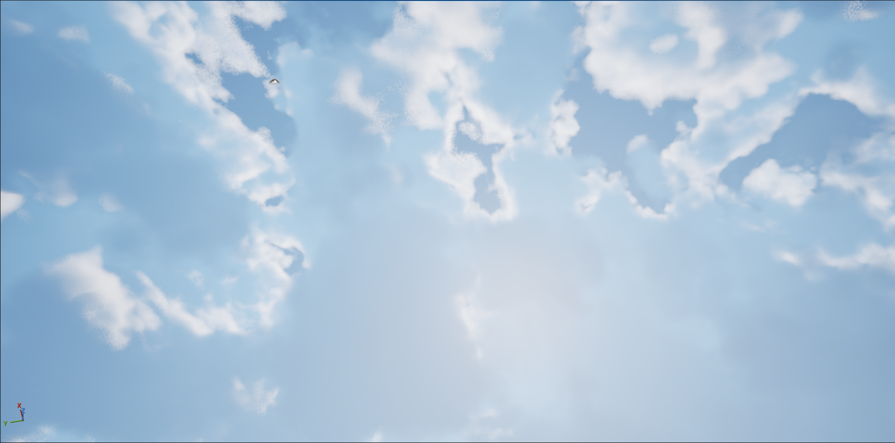
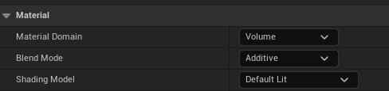
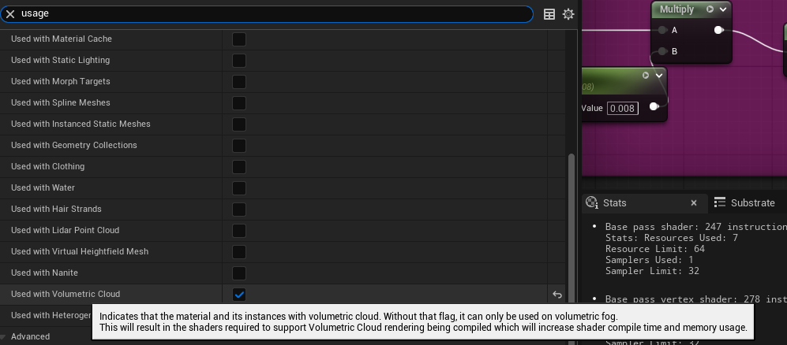
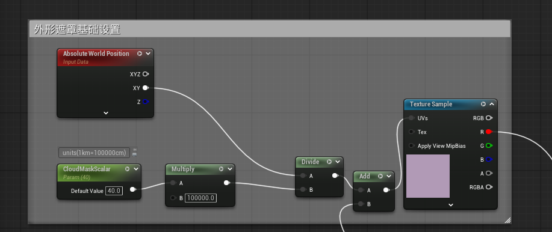
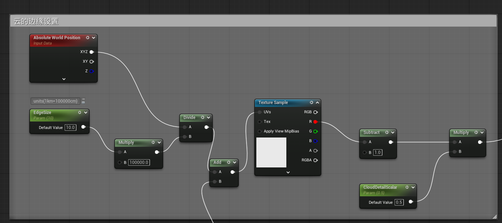
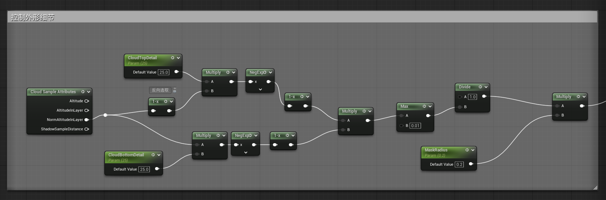
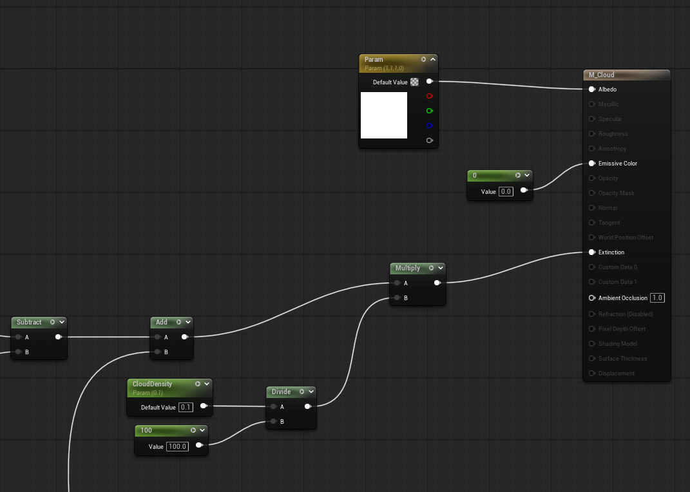
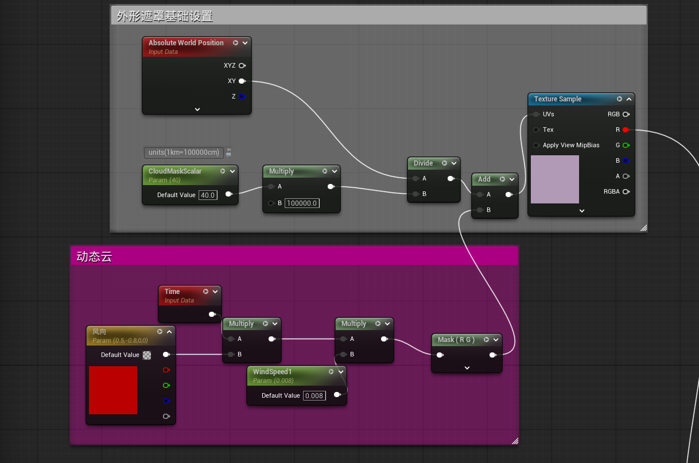
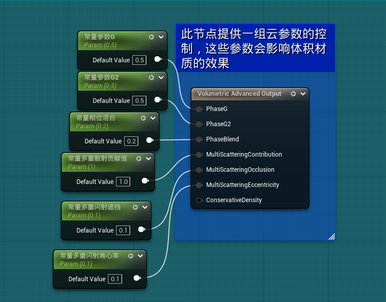

首先对于体积材质，需要勾选以下内容：

如果要用于体积云，还需要勾选上：

### 基本思路
通过World Posiiton的xy来作为uv来设置云的遮罩：

类似的，通过World Position的xyz作为uv来控制3D Texture，然后设置在边缘处的消融效果：

通过专有属性Altitude来进一步控制外形：

### 整合输出

### 动力源添加
给定一个uv方向和系数加到相对应的遮罩uv上，可以实现云的动态效果：

### 高级效果
Volumetric还有一个高级效果节点，存在一些光线的散射系数效果可以控制：

