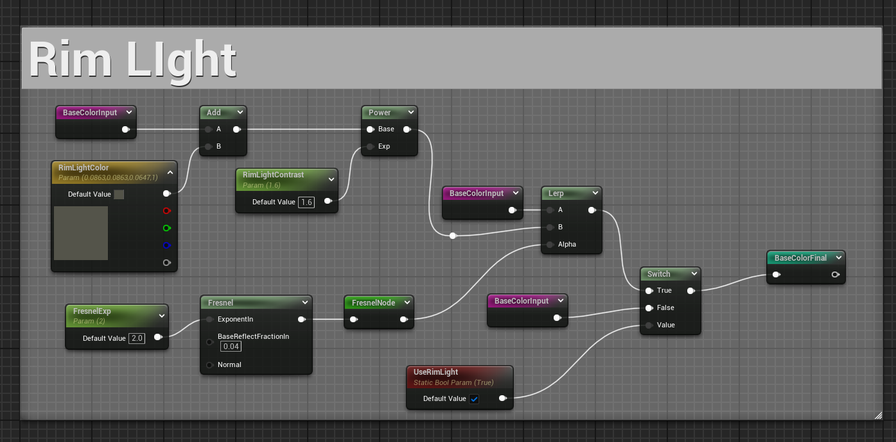

## 视差材质





```hsl
// Basic Params
float PixelToCameraAngle = abs(dot(Parameters.TangentToWorld[2], Parameters.CameraVector));
float LerpAlpha = clamp(PixelToCameraAngle, 0.0, 1.0);
float FloatSteps = lerp(MaxSteps, MinSteps, LerpAlpha);
int NumMaxSteps = floor(FloatSteps);
float StepSize = 1 / FloatSteps;

float3x3 TransTangentToWorld = transpose(Parameters.TangentToWorld);

// Calc View Trace Length
float3 TagentCameraVector = mul(Parameters.CameraVector, TransTangentToWorld);
float2 UVDist = StepSize * HeightRatio * -1.0 * TagentCameraVector.xy / TagentCameraVector.z;

// For Inner Shadow
float3 TangentReverseLightVector = mul(-1 * LightVector, TransTangentToWorld);
float3 TangentLightVector = normalize(float3(TangentReverseLightVector.xy, TangentReverseLightVector.z / (HeightRatio + 0.000001f)));

float2 InDDX = ddx(UV);
float2 InDDY = ddy(UV);

float RayHeight = 1;
float OldRay = 1;
float2 Offset = 0;
float OldTex = 1;
float YIntersect;
int i = 0;

while (i < NumMaxSteps + 2) // +2 to avoid NumMaxSteps = 0
{
    // we use r channel of heightmap as the height
    float TexAtRay = pow(Tex.SampleGrad(TexSampler, UV + Offset, InDDX, InDDY).x, PatternPow);

    if (RayHeight < TexAtRay)
    {
        float XIntersect = (OldRay - OldTex) + (TexAtRay - RayHeight);
        XIntersect = (TexAtRay - RayHeight) / XIntersect;
        YIntersect = (OldRay * (XIntersect)) + (RayHeight * (1 - XIntersect));
        Offset -= (XIntersect * UVDist);
        break;
    }

    OldRay = RayHeight;
    RayHeight -= StepSize;
    Offset += UVDist;
    OldTex = TexAtRay;

    i++;
}

float2 SaveOffset = Offset;
float Shadow = 1;
float Dist = 0;

float TexAtRay = pow(Tex.SampleGrad(TexSampler, UV + Offset, InDDX, InDDY).x, PatternPow) + 0.01;

RayHeight = TexAtRay;
float LighStepSize = 1 / ShadowSteps;

int j = 0;
// while (j < ShadowSteps)
// {
//     if (RayHeight < TexAtRay)
//     {
//         Shadow = 0;
//         break;
//     }
//     else
//     {
//         Shadow = min(Shadow, (RayHeight - TexAtRay) * k / Dist);
//     }

//     OldRay = RayHeight;
//     RayHeight += TangentLightVector.z * LighStepSize;

//     Offset += TangentLightVector.xy * LighStepSize;
//     OldTex = TexAtRay;

//     TexAtRay = pow(Tex.SampleGrad(TexSampler, UV + Offset, InDDX, InDDY).x, PatternPow);
//     Dist += LighStepSize;
//     j++;
// }

float3 finalout;
finalout.xy = SaveOffset + UV;
finalout.z = Shadow;
return finalout;

```

