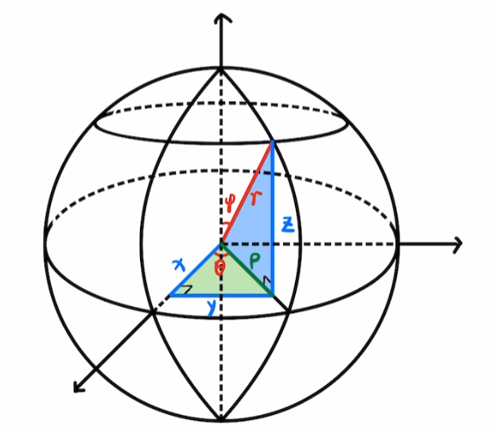
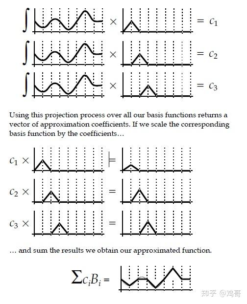
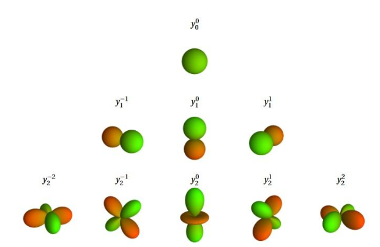

## 球谐函数
球谐函数(Spherical Harmonics)是相当有名的球面基函数，并且SH functions是在虚数上定义的，但我们只对球面上的实数函数(light intensity fields)近似感兴趣。

球谐函数的表达式如下：


$$
\begin{split}
   Y_l^m(\theta,\phi) = \left\{ 
     \begin{aligned}
      \sqrt{2}K_l^m cos(m\phi)P_l^m(cos\theta), m > 0\\
      \sqrt{2}K_l^m sin(-m\phi)P_l^{-m}(cos\theta), m < 0\\
      K_l^{0}P_l^0(cos\theta), m = 0 \\
    \end{aligned}
    \right. \\
\end{split}
$$

其中$K_l^m = \sqrt{\frac{(2l+1)}{4\pi} \frac{(l-|m|)!}{(l+|m|)!}}$, $P$是伴随勒让德多项式。

### 1.伴随勒让德多项式 Associated Legendre Polynomials

- 伴随勒让德多项式可由如下方式生成：
    $$ 
    \begin{split}
    P_m^m &= (-1)^m(2m-1)!!(1-x^2)^{m/2}, P_0^0 = 1 \\
     P_{m+1}^m &= x(2m+1)P_m^m \\
     (l-m)P_l^m &= x(2l-1)P_{l-1}^m - (l+m-1)P_{l-2}^m 
     \end{split}
     $$


### 2.球面坐标系
高数中我们学过直角坐标系与极坐标系，而球面坐标系则是在极坐标系的基础上再增加一个维度，即半径r，因此球面坐标系由三个参数r、θ、φ表示，其中r为半径，θ为极角，φ为方位角，如下图所示：

<div style="text-align: center;">
  
  <figcaption>从直角坐标系看球坐标系</figcaption>
</div>

从直角坐标系看球坐标系，我们可以得到球面坐标系的转换公式：
$$
\begin{split}
x & = r sin \phi cos\theta \\
y & = r sin \phi sin\theta \\ 
z & = r cos \phi
\end{split}
$$


### 3.原函数与基函数
<div style="text-align: center;">
  
  <figcaption>原函数与基函数的关系</figcaption>
</div>

通过图示的点积操作可以求出原函数在基函数上的投影，即原函数在基函数上的系数。
那么，将这些系数和基函数组合起来就可以近似表达出原函数。


### 4.球谐函数的两个重要性质

- 1. 正交性：两个一致的球谐函数的积分值为1，否则为0，即：
  
$$  
\begin{split}
   &\int_\Omega Y_{l}^{m}(\omega) Y_{n}^{k}(\omega) d\omega = \left\{ 
     \begin{aligned}
     & 1, m == n \&\& l==k \\
     & 0, m \neq n || l \neq k \\
    \end{aligned}
    \right. \\
\end{split}
$$

- 2. 旋转不变性：旋转不变目的就是环境光照变化之后我们只需要简单的计算就可以得到光源旋转之后的结果。
  
        旋转不变性的推导，见[知乎文章](https://zhuanlan.zhihu.com/p/363600898)

        $$f(R^{\alpha,\beta,\gamma}(u)) = \sum_{l}^{\inf} \sum_{m=-l}^{l} c_l^m R^{\alpha,\beta,\gamma} Y_l^m(u) $$

        旋转矩阵可以被分离出来，使得无需重新计算$Y_l^m(u)$。

### 5.球谐函数的使用推导（原理忽略）

假设函数$f(x,y,z)$可用球谐函数在单位球上展开($r=1$)，即：
$$
\begin{split}
f(x,y,z) & = \sum_{l=0}^{\infty} \sum_{m=-l}^{l} c_{l}^{m} Y_{l}^{m}(\theta, \phi) \\
& = \sum_{i=0}^{N} c_{i} Y_{i}(\theta, \phi)， 其中i=l(l+1)+m, N= (l+1)^2
\end{split}
$$

注：$i=l(l+1)+m, N= l^2 = \frac{[1+2(l+1)-1](l+1)}{2}$的关系可看下图
<div style="text-align: center;">
  
  <figcaption>球谐金字塔</figcaption>
</div>


#### 5.1 漫反射光照拆解

漫反射光照的公式为：
$$
L(p,\omega_o) = \int_\Omega L_i(p,\omega_i) n \cdot \omega_i d\omega_i
$$

对于点p来说，p是固定量，那么积分的两部分如果都用球谐函数表示，则：
$$
\begin{split}
L_i(p,\omega) = Light(\omega) = \sum_{i=0} c_i Y_i(\omega) \\
n \cdot \omega = t(\omega) = \sum_{i=0} t_i Y_i(\theta, \phi)
\end{split}
$$
代入到漫反射光照公式中，得到：
$$
L(p,\omega_o) = \int_\Omega \sum_{i=0} c_i Y_i(\omega') \sum_{j=0} t_j Y_j(\omega') d\omega'
$$

由于球谐系数是常数，可以提出。并且，在单位球面上的球谐函数的正交性，仅当i=j为1，其余为0：
$$
\begin{split}
L(p,\omega_o) & = \sum_{i=0}\sum_{j=0} c_i t_j  \int_\Omega Y_i(\omega') Y_j(\omega') d\omega' \\
 & = \sum_{i=0}c_i t_i
\end{split}
$$

整个光照公式就化简为常数乘积之和。


利用[原函数投影的知识](#2原函数与基函数),可以事先预计算出常数项$c_i$，体现在代码上：
```
for(pixel &p : Cubemap)
    Li += p.color * Yi(normalise(p.position)) * dw;
```

对于$t_i$需要每个角度分别计算。

#### 5.2 旋转不变性的漫反射光照拆解


### 6.球谐函数的计算
代码来自filament
```cpp
static inline size_t SHindex(ssize_t m, size_t l) {
    return l * (l + 1) + m;
}

void computeShBasis(
        double* const SHb,
        size_t numBands,
        const vec3& s)
{
    // 输入的vec3为球面坐标(s.x = cos(phi)sin(theta), s.y = sin(phi)sin(theta), s.z = cos(theta))
    // handle m=0 separately, since it produces only one coefficient
    double Pml_2 = 0;
    double Pml_1 = 1;
    SHb[0] =  Pml_1;
    for (ssize_t l = 1; l < numBands; l++) {
        // 通过递推式3计算P_l^0
        double Pml = ((2 * l - 1) * Pml_1 * s.z - (l - 1) * Pml_2) / l;
        Pml_2 = Pml_1;
        Pml_1 = Pml;
        // 当m=0时，Y_l^0 = K_l^0P_l^0(cos(theta)) , 此处先把P_l^0计算出来并保存
        SHb[SHindex(0, l)] = Pml;
    }
    double Pmm = 1;
    for (ssize_t m = 1; m < numBands ; m++) {
        Pmm = (1 - 2 * m) * Pmm; // （-1）^m (2m-1)!!  这一部分还没算进去（1-x^2）^{m/2}?
        double Pml_2 = Pmm;
        double Pml_1 = (2 * m + 1)*Pmm*s.z; 
        // l == m 填充Band三角形的两端
        SHb[SHindex(-m, m)] = Pml_2;
        SHb[SHindex( m, m)] = Pml_2;

        // 具体可看band三角形，如果当前band不是最后一个band，那么利用让勒德递推式计算l+1，l+2，...的P_l^m
        if (m + 1 < numBands) {
            // l == m+1
            SHb[SHindex(-m, m + 1)] = Pml_1;
            SHb[SHindex( m, m + 1)] = Pml_1;
            for (ssize_t l = m + 2; l < numBands; l++) {
                double Pml = ((2 * l - 1) * Pml_1 * s.z - (l + m - 1) * Pml_2)
                        / (l - m);
                Pml_2 = Pml_1;
                Pml_1 = Pml;
                SHb[SHindex(-m, l)] = Pml;
                SHb[SHindex( m, l)] = Pml;
            }
        }
    }
    // cm+1 = x * cm - y * sm
    // sm+1 = x * sm - y * cm

    double Cm = s.x;
    double Sm = s.y;
    for (ssize_t m = 1; m <= numBands ; m++) {
        for (ssize_t l = m; l < numBands ; l++) {
            SHb[SHindex(-m, l)] *= Sm;
            SHb[SHindex( m, l)] *= Cm;
        }
        double Cm1 = Cm * s.x - Sm * s.y;
        double Sm1 = Sm * s.x + Cm * s.y;
        Cm = Cm1;
        Sm = Sm1;
    }
}
```


### 7.硬编码球谐表

| Band  |                 m=-2                 |                 m=-1                  |                       m=0                       |                  m=1                  |                     m=2                     |
| :---: | :----------------------------------: | :-----------------------------------: | :---------------------------------------------: | :-----------------------------------: | :-----------------------------------------: |
| $l=0$ |                                      |                                       |        $\frac{1}{2}\sqrt{\frac{1}{\pi}}$        |                                       |                                             |
| $l=1$ |                                      |  $-\frac{1}{2}\sqrt{\frac{3}{\pi}}y$  |       $\frac{1}{2}\sqrt{\frac{3}{\pi}}z$        |  $-\frac{1}{2}\sqrt{\frac{3}{\pi}}x$  |                                             |
| $l=2$ | $\frac{1}{2}\sqrt{\frac{15}{\pi}}xy$ | $-\frac{1}{2}\sqrt{\frac{15}{\pi}}yz$ | $\frac{1}{4}\sqrt{\frac{5}{\pi}}(2z^2-x^2-y^2)$ | $-\frac{1}{2}\sqrt{\frac{15}{\pi}}xz$ | $\frac{1}{4}\sqrt{\frac{15}{\pi}}(x^2-y^2)$ |


```cpp
// Hardcoded spherical harmonic functions for low orders (l is first number
// and m is second number (sign encoded as preceeding 'p' or 'n')).
//
// As polynomials they are evaluated more efficiently in cartesian coordinates,
// assuming that @d is unit. This is not verified for efficiency.
double HardcodedSH00(const Eigen::Vector3d& d) {
  // 0.5 * sqrt(1/pi)
  return 0.282095;
}

double HardcodedSH1n1(const Eigen::Vector3d& d) {
  // -sqrt(3/(4pi)) * y
  return -0.488603 * d.y();
}

double HardcodedSH10(const Eigen::Vector3d& d) {
  // sqrt(3/(4pi)) * z
  return 0.488603 * d.z();
}

double HardcodedSH1p1(const Eigen::Vector3d& d) {
  // -sqrt(3/(4pi)) * x
  return -0.488603 * d.x();
}

double HardcodedSH2n2(const Eigen::Vector3d& d) {
  // 0.5 * sqrt(15/pi) * x * y
  return 1.092548 * d.x() * d.y();
}

double HardcodedSH2n1(const Eigen::Vector3d& d) {
  // -0.5 * sqrt(15/pi) * y * z
  return -1.092548 * d.y() * d.z();
}

double HardcodedSH20(const Eigen::Vector3d& d) {
  // 0.25 * sqrt(5/pi) * (-x^2-y^2+2z^2)
  return 0.315392 * (-d.x() * d.x() - d.y() * d.y() + 2.0 * d.z() * d.z());
}

double HardcodedSH2p1(const Eigen::Vector3d& d) {
  // -0.5 * sqrt(15/pi) * x * z
  return -1.092548 * d.x() * d.z();
}

double HardcodedSH2p2(const Eigen::Vector3d& d) {
  // 0.25 * sqrt(15/pi) * (x^2 - y^2)
  return 0.546274 * (d.x() * d.x() - d.y() * d.y());
}

```