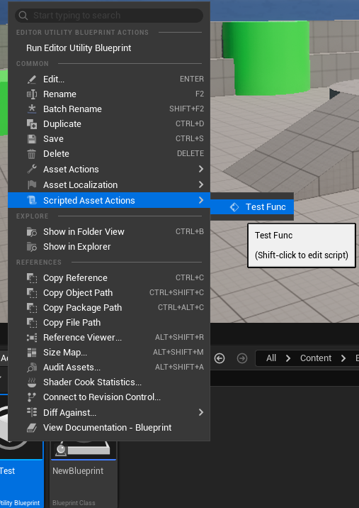
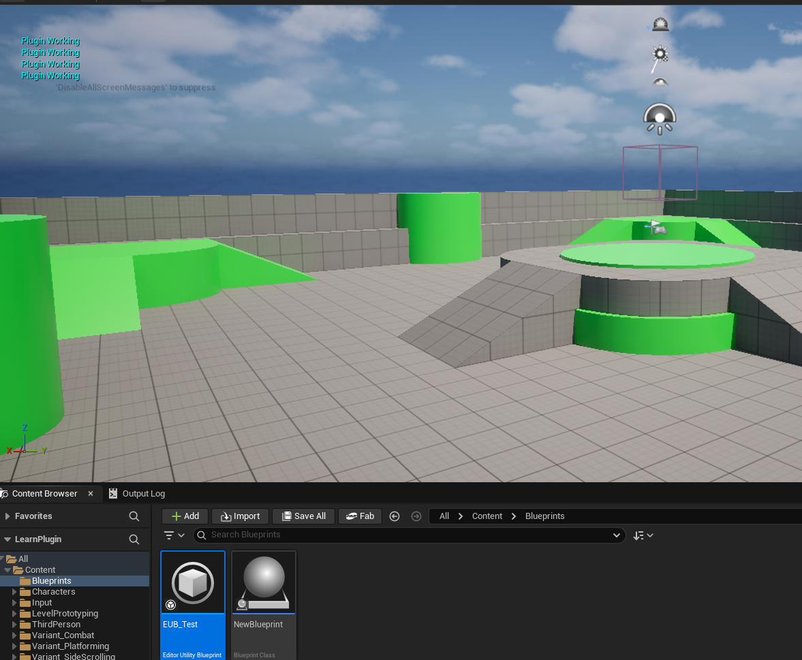
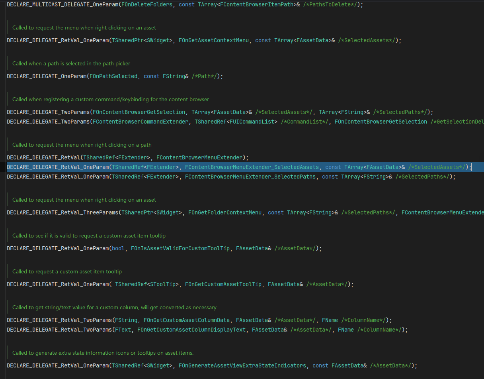

## 为虚幻引擎添加Plugin
### 1. 创建Scripted Asset Action
在创建的空Plugin中，创建一个类继承自`QuickAssetAction`，当为其中的成员函数设置`UFUNCTION(CallInEditor)`，即可在编辑器中使用。

> 此处有一个bug，无法在蓝图中查看到Scripted Asset Action的按钮，暂不知原因，但若该蓝图类继承自`QuickAssetAction`，则可以右键看到该按钮


```cpp
// QuickAssetAction.h
UCLASS()
class TESTPLUG_API UQuickAssetAction : public UAssetActionUtility
{
	GENERATED_BODY()
public:
	UFUNCTION(CallInEditor)
	void TestFunc();
};

// QuickAssetAction.cpp
void UQuickAssetAction::TestFunc()
{
	if(GEngine)
	{
		GEngine->AddOnScreenDebugMessage(-1,8.f,FColor::Cyan,TEXT("Plugin Working"));
	}
}

```



基于此，可以利用`EditorUtilityLibrary`和`EditorAssetLibrary`提供的增删改查（Get/Set）方法，根据实际的需要，实现一些资产复制，重新命名等快捷的功能。
例如下面，简单实现一个复制多个蓝图资产的功能：
```cpp
void UQuickAssetAction::DuplicateAssets(int32 NumOfDuplicates)
{
	if (NumOfDuplicates < 0)
	{
		TestPluginPrint(TEXT("Please Input Valid NumOfDuplicates"), FColor::Red);
                return ;
	}

	uint16_t Counter = 0;
	
	TArray<UObject*> SelectedAssets = UEditorUtilityLibrary::GetSelectedAssets();
	for(const FAssetData& SelectedAssetData:SelectedAssets)
	{
		for(int32 i = 0; i < NumOfDuplicates; i++)
		{
			const FString SourceAssetPath = SelectedAssetData.ObjectPath.ToString();
			const FString NewDuplicatedAssetName = SelectedAssetData.AssetName.ToString() + TEXT("_") + FString::FromInt(i+1);
			const FString NewPathName = FPaths::Combine(SelectedAssetData.PackagePath.ToString(), NewDuplicatedAssetName);

			if(UEditorAssetLibrary::DuplicateAsset(SourceAssetPath, NewPathName))
			{	
				UEditorAssetLibrary::SaveAsset(NewPathName,false);
				++Counter;
			}
		}
	}

	TestPluginPrint(TEXT("Successfully duplicated " + FString::FromInt(Counter) + " files"), FColor::Green);
}

```

下面为进一步展示QuickAssetAction的基础用法，增加相关实际的用例。在下面的例子中，使用以下的方式作为提示：
```cpp
EAppReturnType::Type ShowMsgDialog(EAppMsgType::Type MsgType, const FString& Message, 
bool bShowMsgAsWarning = true)
{	
	if(bShowMsgAsWarning)
	{
		FText MsgTitle = FText::FromString(TEXT("Warning"));

		return FMessageDialog::Open(MsgType,FText::FromString(Message),&MsgTitle);
	}
	else
	{
		return FMessageDialog::Open(MsgType,FText::FromString(Message));
	}			
}

void ShowNotifyInfo(const FString& Message)
{
	FNotificationInfo NotifyInfo(FText::FromString(Message));
	NotifyInfo.bUseLargeFont = true;
	NotifyInfo.FadeOutDuration = 7.f;

	FSlateNotificationManager::Get().AddNotification(NotifyInfo);
}
```


#### 1.1 例子 删除未使用的资产
思路就是检查一个资产的引用计数，如果引用计数为0，则删除该资产。
```cpp
void UQuickAssetAction::RemoveUnusedAssets()
{
	TArray<FAssetData> SelectedAssetsData = UEditorUtilityLibrary::GetSelectedAssetData();
	TArray<FAssetData> UnusedAssetsData;

	for(const FAssetData& SelectedAssetData:SelectedAssetsData)
	{	
		TArray<FString> AssetRefrencers =
		UEditorAssetLibrary::FindPackageReferencersForAsset(SelectedAssetData.ObjectPath.ToString());

		if(AssetRefrencers.Num()==0)
		{
			UnusedAssetsData.Add(SelectedAssetData);
		}
	}

	if(UnusedAssetsData.Num()==0)
	{
		ShowMsgDialog(EAppMsgType::Ok,TEXT("No unused asset found among selected assets"),false);
		return;
	}

	const int32 NumOfAssetsDeleted = ObjectTools::DeleteAssets(UnusedAssetsData);

	if(NumOfAssetsDeleted == 0) return;

	ShowNotifyInfo(TEXT("Successfully deleted " + FString::FromInt(NumOfAssetsDeleted) + TEXT(" unused assets")));
}
```

#### 1.2 例子 Redirect
https://dev.epicgames.com/documentation/en-us/unreal-engine/programming-in-the-unreal-engine-architecture
https://dev.epicgames.com/documentation/en-us/unreal-engine/asset-registry-in-unreal-engine

```cpp
void UQuickAssetAction::FixUpRedirectors()
{
	TArray<UObjectRedirector*> RedirectorsToFixArray;

	FAssetRegistryModule& AssetRegistryModule =
	FModuleManager::Get().LoadModuleChecked<FAssetRegistryModule>(TEXT("AssetRegistry"));

	FARFilter Filter;
	Filter.bRecursivePaths = true;
	Filter.PackagePaths.Emplace("/Game");
	Filter.ClassNames.Emplace("ObjectRedirector");

	TArray<FAssetData> OutRedirectors;

	AssetRegistryModule.Get().GetAssets(Filter,OutRedirectors);

	for(const FAssetData& RedirectorData:OutRedirectors)
	{
		if(UObjectRedirector* RedirectorToFix = Cast<UObjectRedirector>(RedirectorData.GetAsset()))
		{
			RedirectorsToFixArray.Add(RedirectorToFix);
		}
	}

	FAssetToolsModule& AssetToolsModule =
	FModuleManager::LoadModuleChecked<FAssetToolsModule>(TEXT("AssetTools"));

	AssetToolsModule.Get().FixupReferencers(RedirectorsToFixArray);
}
```

## 2. 拓展Content Menu
需要添加对"ContentBrowser"的Module依赖

```cpp
void FTestPlugModule::StartupModule()
{
	// This code will execute after your module is loaded into memory; the exact timing is specified in the .uplugin file per-module
	InitCBMenuExtention();
}

void FTestPlugModule::ShutdownModule()
{
	// This function may be called during shutdown to clean up your module.  For modules that support dynamic reloading,
	// we call this function before unloading the module.
}

#pragma region ContentBrowserMenuExtention

void FTestPlugModule::InitCBMenuExtention()
{
	FContentBrowserModule& ContentBrowserModule =
	FModuleManager::LoadModuleChecked<FContentBrowserModule>(TEXT("ContentBrowser"));

	TArray<FContentBrowserMenuExtender_SelectedPaths>& ContentBrowserModuleMenuExtenders =
	ContentBrowserModule.GetAllPathViewContextMenuExtenders();

	/*FContentBrowserMenuExtender_SelectedPaths CustomCBMenuDelegate;
	CustomCBMenuDelegate.BindRaw(this,&FSuperManagerModule::CustomCBMenuExtender);

	ContentBrowserModuleMenuExtenders.Add(CustomCBMenuDelegate);*/

	ContentBrowserModuleMenuExtenders.Add(FContentBrowserMenuExtender_SelectedPaths::
	CreateRaw(this,&FTestPlugModule::CustomCBMenuExtender));
	
}

TSharedRef<FExtender> FTestPlugModule::CustomCBMenuExtender(const TArray<FString>& SelectedPaths)
{
	TSharedRef<FExtender> MenuExtender (new FExtender());

	if(SelectedPaths.Num()>0)
	{
		MenuExtender->AddMenuExtension(FName("Delete"),
		EExtensionHook::After,
		TSharedPtr<FUICommandList>(),
		FMenuExtensionDelegate::CreateRaw(this,&FTestPlugModule::AddCBMenuEntry));
	}

	return MenuExtender;
}

void FTestPlugModule::AddCBMenuEntry(FMenuBuilder& MenuBuilder)
{
	MenuBuilder.AddMenuEntry
	(
		FText::FromString(TEXT("Test Add Menu")),
		FText::FromString(TEXT("Just For Testing")),
		FSlateIcon(),
		FExecuteAction::CreateRaw(this,&FTestPlugModule::OnTestButtonClicked)
	);
}

void FTestPlugModule::OnTestButtonClicked()
{
	PluginShowNotifyInfo("Test Add Menu Success!");
}


#pragma endregion
```

类似的思路可以实现其它对Content Browser的扩展，比如右键菜单，拖拽文件等。具体的绑定到的委托有所不同
