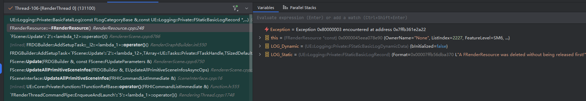

## 向虚幻引擎中添加自定义的顶点工厂

> 尚未完成，完成后添加对各个部分的分析

- 问题记录
  - 已解决：添加自定义ush后引起的Shader编译Crush,添加SceneData和`#include "VertexFactoryDefaultInterface.ush"`
  - 已解决：在蓝图Actor下添加MeshComponent触发Crush,疑似LOD在RenderProxy设置有问题？
：RenderProxy没有正确被保存。


### 1. Step1 添加对应ush着色器文件
```hlsl
#include "/Engine/Private/VertexFactoryCommon.ush"

struct FVertexFactoryInput {
	float4 Position : ATTRIBUTE0;
	float3 TangentX : ATTRIBUTE1;
	float4 TangentZ : ATTRIBUTE2;
};

struct FVertexFactoryIntermediates {
	// Position in world space
	float3 Position;
	// Vertex color
	half4 Color;
	// Tangent matrix
	half3x3 TangentToLocal;
	half3x3 TangentToWorld;
	half TangentToWorldSign;
};

struct FVertexFactoryInterpolantsVSToPS {
	float4 TangentToWorld0 : TEXCOORD1_centroid;
	float4 TangentToWorld2 : TEXCOORD2_centroid;
};

FInstanceSceneData GetInstanceData()
{
	return GetSceneDataIntermediates().InstanceData; 
}

half3x3 CalcTangentToLocal(FVertexFactoryInput Input, out float TangentSign)
{
	half3x3 Result;
	half3 TangentInputX = Input.TangentX;
	half4 TangentInputZ = Input.TangentZ;
	half3 TangentX = TangentBias(TangentInputX);
	half4 TangentZ = TangentBias(TangentInputZ);
	TangentSign = TangentZ.w;

	half3 TangentY = cross(TangentZ.xyz, TangentX.xyz) * TangentZ.w;
	Result[0] = cross(TangentY, TangentZ.xyz) * TangentSign;
	Result[1] = TangentY;
	Result[2] = TangentZ.xyz;
	return Result;
}

half3x3 CalcTangentToWorldNoScale(half3x3 TangentToLocal)
{
	half3x3 LocalToWorld = (half3x3) DFToFloat3x3(GetInstanceData().LocalToWorld);
	half3 InvScale = GetInstanceData().InvNonUniformScale;
	LocalToWorld[0] *= InvScale.x;
	LocalToWorld[1] *= InvScale.y;
	LocalToWorld[2] *= InvScale.z;
	return mul(TangentToLocal, LocalToWorld);
}

FVertexFactoryIntermediates GetVertexFactoryIntermediates(FVertexFactoryInput Input)
{
	FVertexFactoryIntermediates Result;
	Result.Color = half4(1,1,1,1);
	Result.Position = Input.Position.xyz;
	float TangentSign;
	Result.TangentToLocal = CalcTangentToLocal(Input, TangentSign);
	Result.TangentToWorld = CalcTangentToWorldNoScale(Result.TangentToLocal);
	Result.TangentToWorldSign = TangentSign * GetInstanceData().DeterminantSign;
	return Result;
}

float4 VertexFactoryGetWorldPosition(FVertexFactoryInput Input, FVertexFactoryIntermediates Intermediates)
{
	// Note: 用于VS中世界位置， 一些特殊效果可以自定义实现
	FDFMatrix LocalToWorld = GetInstanceData().LocalToWorld;
	return TransformLocalToTranslatedWorld(Input.Position.xyz, LocalToWorld);
}

float3x3 VertexFactoryGetTangentToLocal(FVertexFactoryInput Input, FVertexFactoryIntermediates Intermediates)
{
	// Note: 用于VS中获取切线空间到本地空间的矩阵
	return Intermediates.TangentToLocal;
}

float3 VertexFactoryGetWorldNormal(FVertexFactoryInput Input, FVertexFactoryIntermediates Intermediates)
{
	//  Note: 获取世界坐标法线
	return Intermediates.TangentToWorld[2];
}

FMaterialVertexParameters GetMaterialVertexParameters(FVertexFactoryInput Input, FVertexFactoryIntermediates Intermediates, float3 WorldPosition, float3x3 TangentToLocal)
{
	// Note: 生成从VS到PS的插值数据
	// Impl: 根据需要实现
	FMaterialVertexParameters Result = MakeInitializedMaterialVertexParameters();
	Result.SceneData = GetSceneDataIntermediates();
	Result.WorldPosition = WorldPosition;
	Result.VertexColor = half4(1.0f, 1.0f, 1.0f, 1.0f);
	Result.TangentToWorld = mul(TangentToLocal, GetLocalToWorld3x3(Result));
	return Result;
}

FVertexFactoryInterpolantsVSToPS VertexFactoryGetInterpolantsVSToPS(FVertexFactoryInput Input, FVertexFactoryIntermediates Intermediates, FMaterialVertexParameters VertexParameters)
{
	// Note: 获取PS中的材质参数
	// Impl: 根据需要实现
	FVertexFactoryInterpolantsVSToPS Interpolants = (FVertexFactoryInterpolantsVSToPS) 0;
	Interpolants.TangentToWorld0 = float4(Intermediates.TangentToWorld[0], 0.0f);
	Interpolants.TangentToWorld2 = float4(Intermediates.TangentToWorld[2], Intermediates.TangentToWorldSign);
	return Interpolants;
}

FMaterialPixelParameters GetMaterialPixelParameters(FVertexFactoryInterpolantsVSToPS Interpolants, float4 SVPosition)
{
	// Note: 获取PS中的材质参数
	// Impl: 根据需要实现
	FMaterialPixelParameters Result = MakeInitializedMaterialPixelParameters();
	half3 TangentToWorld0 = Interpolants.TangentToWorld0.xyz;
	half4 TangentToWorld2 = Interpolants.TangentToWorld2;
	Result.TangentToWorld = AssembleTangentToWorld(TangentToWorld0, TangentToWorld2);
	Result.PrimitiveId = 0;
	Result.TwoSidedSign = 1;

	return Result;
}

float4 VertexFactoryGetRasterizedWorldPosition(FVertexFactoryInput Input, FVertexFactoryIntermediates Intermediates, float4 TranslatedWorldPosition)
{
	// Note: 裁剪空间前的世界坐标，可以自定义一些特殊效果
	// Impl: 未作处理，返回默认的TranslatedWorldPosition
	return TranslatedWorldPosition;
}

float4 VertexFactoryGetPreviousWorldPosition(FVertexFactoryInput Input, FVertexFactoryIntermediates Intermediates)
{
	// Note: 获取前一帧的世界坐标, 一些基于Temporal的算法可能会用到
	// Impl: 这里暂时忽略，直接返回了当前坐标
	return VertexFactoryGetWorldPosition(Input, Intermediates);
}

FSceneDataIntermediates GetSceneDataIntermediates(FVertexFactoryIntermediates Intermediates)
{
	return GetSceneDataIntermediates();
}

#define VF_IMPLEMENTED_GET_SCENE_DATA_INTERMEDIATES
#include "/Engine/Private/VertexFactoryDefaultInterface.ush"
```

### 2. Step2 添加对应的自定义MeshComponent文件
   
```cpp
// Fill out your copyright notice in the Description page of Project Settings.

#pragma once

#include "CoreMinimal.h"
#include "Components/PrimitiveComponent.h"
#include "MyMeshComponent.generated.h"


UCLASS(ClassGroup=(Custom), meta=(BlueprintSpawnableComponent))
class CUSTOMMESHCOMP_API UMyMeshComponent : public UPrimitiveComponent
{
	GENERATED_BODY()

public:
	virtual FPrimitiveSceneProxy* CreateSceneProxy() override;
	virtual FBoxSphereBounds CalcBounds(const FTransform& LocalToWorld) const override;
};

```

```cpp
#include "MyMeshComponent.h"
#include "MaterialDomain.h"
#include "VertexFactory.h"

class FMyMeshVertexFactory : public FVertexFactory
{
	DECLARE_VERTEX_FACTORY_TYPE(FMyMeshVertexFactory)

public:
	FMyMeshVertexFactory(ERHIFeatureLevel::Type InFeatureLevel): FVertexFactory(InFeatureLevel)
	{
	}

	// InitRHI: 在渲染线程初始化对象时调用或或手动调用InitResource
	virtual void InitRHI(FRHICommandListBase& RHICmdList) override
	{
		FVertexDeclarationElementList Elements;
		// 顶点输入的声明
		FVertexStreamComponent PositionStreamComponent;
		PositionStreamComponent.VertexBuffer = PositionBuffer;
		PositionStreamComponent.Stride = sizeof(FVector3f);
		PositionStreamComponent.Type = VET_Float3;
		PositionStreamComponent.Offset = 0;
		PositionStreamComponent.VertexStreamUsage = EVertexStreamUsage::Default;
		Elements.Add(AccessStreamComponent(PositionStreamComponent, 0));

		FVertexStreamComponent TangentXStreamComponent;
		TangentXStreamComponent.VertexBuffer = TangentBuffer;
		TangentXStreamComponent.Stride = sizeof(FPackedNormal) * 2;
		TangentXStreamComponent.Type = VET_PackedNormal;
		TangentXStreamComponent.Offset = 0;
		TangentXStreamComponent.VertexStreamUsage = EVertexStreamUsage::Default;
		Elements.Add(AccessStreamComponent(TangentXStreamComponent, 1));

		FVertexStreamComponent TangentZStreamComponent;
		TangentZStreamComponent.VertexBuffer = TangentBuffer;
		TangentZStreamComponent.Stride = sizeof(FPackedNormal) * 2;
		TangentZStreamComponent.Type = VET_PackedNormal;
		TangentZStreamComponent.Offset =  sizeof(FPackedNormal);
		TangentZStreamComponent.VertexStreamUsage = EVertexStreamUsage::Default;
		Elements.Add(AccessStreamComponent(TangentZStreamComponent, 2));

		InitDeclaration(Elements, EVertexInputStreamType::Default);
		check(GetDeclaration());
	}

	virtual void ReleaseRHI() override
	{
		UniformBuffer.SafeRelease();
		FVertexFactory::ReleaseRHI();
	}

	// 决定对应Shader是否编译
	static bool ShouldCompilePermutation(const FVertexFactoryShaderPermutationParameters& Parameters)
	{
		return true;
	}

	// 修改Shader编译参数
	static void ModifyCompilationEnvironment(const FVertexFactoryShaderPermutationParameters& Parameters,
	                                         FShaderCompilerEnvironment& OutEnvironment)
	{
	}

	// 验证Shader编译结果是否符合预期
	static void ValidateCompiledResult(const FVertexFactoryType* Type, EShaderPlatform Platform,
	                                   const FShaderParameterMap& ParameterMap, TArray<FString>& OutErrors)
	{
	}

protected:
	FVertexBuffer* PositionBuffer = nullptr;
	FVertexBuffer* TangentBuffer = nullptr;
	FUniformBufferRHIRef UniformBuffer;
	friend class FMyMeshSceneProxy;
};

IMPLEMENT_VERTEX_FACTORY_TYPE(FMyMeshVertexFactory, "/Plugins/CustomMeshComp/Shaders/Private/MyMeshVertexFactory.ush",
	EVertexFactoryFlags::UsedWithMaterials | EVertexFactoryFlags::SupportsManualVertexFetch  // 可用用于材质
);

constexpr uint32 NumVertices = 36;
// Position index buffer
class FMyCubePositionVertexBuffer: public FVertexBuffer {
public:
	virtual void InitRHI(FRHICommandListBase& RHICmdList) override {
		FVector3f Data[]{
			{-50.0f, -50.0f, -50.0f}, { 50.0f, -50.0f, -50.0f}, { 50.0f,  50.0f, -50.0f}, { 50.0f,  50.0f, -50.0f}, {-50.0f,  50.0f, -50.0f}, {-50.0f, -50.0f, -50.0f},
			{-50.0f, -50.0f,  50.0f}, { 50.0f,  50.0f,  50.0f}, { 50.0f, -50.0f,  50.0f}, { 50.0f,  50.0f,  50.0f}, {-50.0f, -50.0f,  50.0f}, {-50.0f,  50.0f,  50.0f},
			{-50.0f,  50.0f,  50.0f}, {-50.0f, -50.0f, -50.0f}, {-50.0f,  50.0f, -50.0f}, {-50.0f, -50.0f, -50.0f}, {-50.0f,  50.0f,  50.0f}, {-50.0f, -50.0f,  50.0f},
			{ 50.0f,  50.0f,  50.0f}, { 50.0f,  50.0f, -50.0f}, { 50.0f, -50.0f, -50.0f}, { 50.0f, -50.0f, -50.0f}, { 50.0f, -50.0f,  50.0f}, { 50.0f,  50.0f,  50.0f},
			{-50.0f, -50.0f, -50.0f}, { 50.0f, -50.0f,  50.0f}, { 50.0f, -50.0f, -50.0f}, { 50.0f, -50.0f,  50.0f}, {-50.0f, -50.0f, -50.0f}, {-50.0f, -50.0f,  50.0f},
			{-50.0f,  50.0f, -50.0f}, { 50.0f,  50.0f, -50.0f}, { 50.0f,  50.0f,  50.0f}, { 50.0f,  50.0f,  50.0f}, {-50.0f,  50.0f,  50.0f}, {-50.0f,  50.0f, -50.0f},
		};
		constexpr uint32 BufferSize = NumVertices * sizeof(FVector3f);
		FRHIResourceCreateInfo CreateInfo{ TEXT("MyCubePositionVertexBuffer") };
		VertexBufferRHI = RHICmdList.CreateVertexBuffer(BufferSize, BUF_Static, CreateInfo);
		void* LockedData = RHICmdList.LockBuffer(VertexBufferRHI, 0, BufferSize, RLM_WriteOnly);
		FMemory::Memcpy(LockedData, Data, BufferSize);
		RHICmdList.UnlockBuffer(VertexBufferRHI);
	}
};

// vertex index Buffer
class FMyCubeTangentVertexBuffer: public FVertexBuffer {
public:
	virtual void InitRHI(FRHICommandListBase& RHICmdList) override {
		struct FTangentData {
			FPackedNormal TangentX, TangentZ;
		};
		FTangentData Data[NumVertices];
		for (int32 i = 0; i < 6; ++i) { Data[i] = { FVector3f{-1.0f,  0.0f,  0.0f}, FVector3f{ 0.0f,  0.0f, -1.0f} }; }
		for (int32 i = 0; i < 6; ++i) { Data[i + 6] = { FVector3f{ 1.0f,  0.0f,  0.0f}, FVector3f{ 0.0f,  0.0f,  1.0f} }; }
		for (int32 i = 0; i < 6; ++i) { Data[i + 12] = { FVector3f{ 0.0f,  0.0f,  1.0f}, FVector3f{-1.0f,  0.0f,  0.0f} }; }
		for (int32 i = 0; i < 6; ++i) { Data[i + 18] = { FVector3f{ 0.0f,  0.0f, -1.0f}, FVector3f{ 1.0f,  0.0f,  0.0f} }; }
		for (int32 i = 0; i < 6; ++i) { Data[i + 24] = { FVector3f{ 1.0f,  0.0f,  0.0f}, FVector3f{ 0.0f, -1.0f,  0.0f} }; }
		for (int32 i = 0; i < 6; ++i) { Data[i + 30] = { FVector3f{ 1.0f,  0.0f,  0.0f}, FVector3f{ 0.0f,  1.0f,  0.0f} }; }
		constexpr uint32 BufferSize = NumVertices * sizeof(FTangentData);
		FRHIResourceCreateInfo CreateInfo{ TEXT("MyCubeTangentVertexBuffer") };
		VertexBufferRHI = RHICmdList.CreateVertexBuffer(BufferSize, BUF_Static, CreateInfo);
		void* LockedData = RHICmdList.LockBuffer(VertexBufferRHI, 0, BufferSize, RLM_WriteOnly);
		FMemory::Memcpy(LockedData, Data, BufferSize);
		RHICmdList.UnlockBuffer(VertexBufferRHI);
	}
};

// Index buffer
class FMyCubeIndexBuffer: public FIndexBuffer {
public:
	virtual void InitRHI(FRHICommandListBase& RHICmdList) override {
		uint16 Data[NumVertices];
		for(int32 i=0; i<NumVertices; ++i) {
			Data[i] = (uint16)i;
		}
		constexpr uint32 BufferSize = NumVertices * sizeof(uint16);
		FRHIResourceCreateInfo CreateInfo{ TEXT("MyCubeIndexBuffer") };
		IndexBufferRHI = RHICmdList.CreateIndexBuffer(sizeof(uint16), BufferSize, BUF_Static, CreateInfo);
		void* LockedData = RHICmdList.LockBuffer(IndexBufferRHI, 0, BufferSize, RLM_WriteOnly);
		FMemory::Memcpy(LockedData, Data, BufferSize);
		RHICmdList.UnlockBuffer(IndexBufferRHI);
	}
};


class FMyMeshSceneProxy : public FPrimitiveSceneProxy
{
public:
	FMyMeshSceneProxy(UMyMeshComponent* InComponent)
		:FPrimitiveSceneProxy(InComponent),
		VertexFactory(InComponent->GetWorld()->GetFeatureLevel())
	{
		
	}
	virtual ~FMyMeshSceneProxy() override
	{
		VertexFactory.ReleaseResource();
		if (PositionVertexBuffer)
		{
			PositionVertexBuffer->ReleaseResource();
		}
		if (TangentVertexBuffer)
		{
			TangentVertexBuffer->ReleaseResource();
		}
		if (IndexBuffer)
		{
			IndexBuffer->ReleaseResource();
		}
	}

	virtual SIZE_T GetTypeHash() const override
	{
		static size_t UniquePointer;
		return reinterpret_cast<size_t>(&UniquePointer);
	}

	virtual uint32 GetMemoryFootprint() const override
	{
		return sizeof(*this) + GetAllocatedSize();
	}

	void CreateRenderThreadResources(FRHICommandListBase& RHICmdList) override
	{
		PositionVertexBuffer = MakeUnique<FMyCubePositionVertexBuffer>();
		PositionVertexBuffer->InitResource(RHICmdList);
		TangentVertexBuffer = MakeUnique<FMyCubeTangentVertexBuffer>();
		TangentVertexBuffer->InitResource(RHICmdList);
		IndexBuffer = MakeUnique<FMyCubeIndexBuffer>();
		IndexBuffer->InitResource(RHICmdList);;
		// 初始化VertexFactory
		VertexFactory.PositionBuffer = PositionVertexBuffer.Get();
		VertexFactory.TangentBuffer = TangentVertexBuffer.Get();
		VertexFactory.InitResource(RHICmdList);	
	}

	virtual FPrimitiveViewRelevance GetViewRelevance(const FSceneView* View) const override
	{
		FPrimitiveViewRelevance Result;
		Result.bDrawRelevance = IsShown(View);
		Result.bDynamicRelevance = true; // GetDynamicMeshElements
		Result.bStaticRelevance = false;
		return Result;
	}

	virtual void GetDynamicMeshElements(const TArray<const FSceneView*>& Views, const FSceneViewFamily& ViewFamily, uint32 VisibilityMap, FMeshElementCollector& Collector) const override
	{
		FMaterialRenderProxy* MaterialRenderProxy = UMaterial::GetDefaultMaterial(EMaterialDomain::MD_Surface)->GetRenderProxy();
		// 逐view 搜集
		for (int32 ViewIndex = 0; ViewIndex < Views.Num(); ++ViewIndex) {
			if (VisibilityMap & (1 << ViewIndex)) {
				// Create a mesh batch
				FMeshBatch& MeshBatch = Collector.AllocateMesh();
				MeshBatch.bUseAsOccluder = false;
				MeshBatch.VertexFactory = &VertexFactory;
				MeshBatch.MaterialRenderProxy = MaterialRenderProxy;
				MeshBatch.ReverseCulling = IsLocalToWorldDeterminantNegative();
				MeshBatch.DepthPriorityGroup = SDPG_World;
				MeshBatch.Type = EPrimitiveType::PT_TriangleList;

				// Setup index buffer
				FMeshBatchElement& Element = MeshBatch.Elements[0];
				Element.FirstIndex = 0;
				Element.NumPrimitives = NumVertices / 3;
				Element.IndexBuffer = IndexBuffer.Get();
				Element.MinVertexIndex = 0;
				Element.MaxVertexIndex = NumVertices - 1;

				// Primitive uniform buffer is required.
				Element.PrimitiveUniformBuffer = GetUniformBuffer();
				MeshBatch.bCanApplyViewModeOverrides = false;
				Collector.AddMesh(ViewIndex, MeshBatch);
			}
		}
	}
	
private:
	FMyMeshVertexFactory VertexFactory;
	TUniquePtr<FVertexBuffer> PositionVertexBuffer;
	TUniquePtr<FVertexBuffer> TangentVertexBuffer;
	TUniquePtr<FIndexBuffer> IndexBuffer;
};


FPrimitiveSceneProxy* UMyMeshComponent::CreateSceneProxy()
{
	return new FMyMeshSceneProxy(this);
}

FBoxSphereBounds UMyMeshComponent::CalcBounds(const FTransform& LocalToWorld) const
{
	FBoxSphereBounds MyBounds{ {0.0,0.0,0.0}, {50.0, 50.0, 50.0}, 50.0 };
	return MyBounds.TransformBy(LocalToWorld);
}

```


### 3. Result
