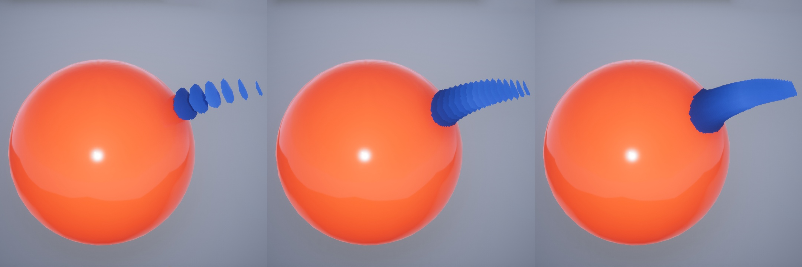
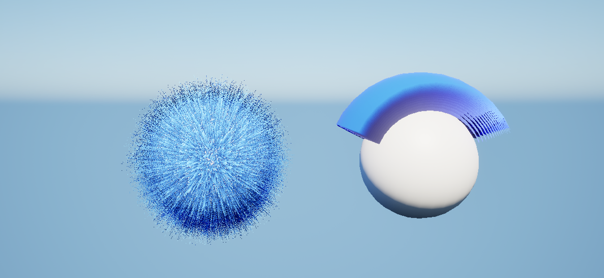
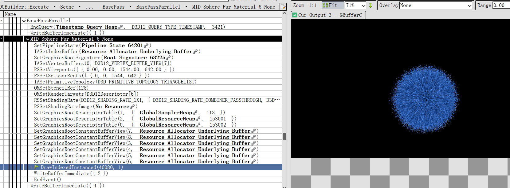

## GFurPro
GFurPro是一个Unreal 插件，基于Shell Fur实现的毛发系统。Shell Fur的基本原理如下图：

即将同一个面片反复渲染多次以得到叠加的最后效果。
对最后效果的基本控制，有两个核心概念为FurPattern和FlowMesh。
以下图为例，FurPattern控制了叠加的面片的不同消融结果，FlowMesh则控制了在原Mesh上从何处开始叠加。

从RenderDoc的截帧看，GFurPro的实现应该是一次生成多个面片的顶点数据，而不是这位大佬的多Pass思路[虚幻5渲染编程(材质篇)[第二卷: Shell Fur Cloth Material]](https://zhuanlan.zhihu.com/p/395723380)

### 实现原理

> 尚未完成，需待[3-添加自定义MeshComponent](/Practice/3-AddCustomVertexFactory.md)完成后继续