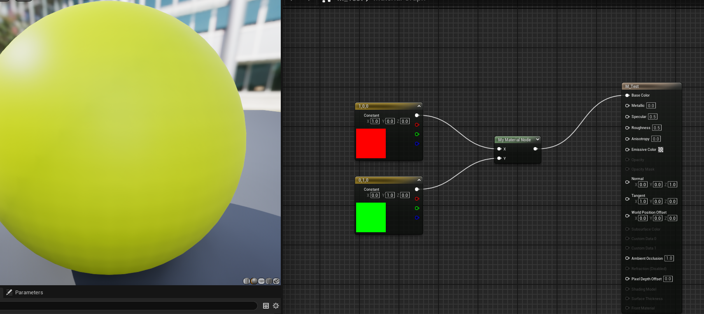

原理及部分细节见[材质基础](../Materials/0-材质基础概念和原理.md)

要在C++侧添加自定义的UMaterialExpression，需要继承`UMaterialExpression`类，并实现其纯虚函数。
下面的代码以加法为例:

```cpp
// Fill out your copyright notice in the Description page of Project Settings.

#pragma once

#include "CoreMinimal.h"
#include "Materials/MaterialExpression.h"
#include "MaterialExpressionMyNode.generated.h"

/**
 * 
 */
UCLASS()
class CUSTOMMATERIALNODETEMPLATE_API UMaterialExpressionMyNode : public UMaterialExpression
{
	GENERATED_BODY()

public:
	UPROPERTY()
	FExpressionInput X;

	UPROPERTY()
	FExpressionInput Y;

	virtual void RebuildOutputs();

#if WITH_EDITOR
	virtual FText GetCreationName() const override { return FText::FromString(TEXT("MyAdd")); }
	/*Compiling the material. Called when the material is being compiled.
	Compiler - the object responsible for material compilation.
	OutputIndex - the index of the output being compiled.
	Returns the index of the compiled expression in the material graph.*/
	virtual int32 Compile(class FMaterialCompiler* Compiler, int32 OutputIndex) override;

	/*Retrieving the node's caption, which is displayed in the material editor.
	OutCaptions - an array of strings to which the node's caption is added.*/
	virtual void GetCaption(TArray<FString>& OutCaptions) const override;

	/*Retrieving the list of inputs for the node.
	Returns a view (TArrayView) of an array of pointers to input expressions (FExpressionInput*).*/
	virtual TArrayView<FExpressionInput*> GetInputsView() override;

	/*Retrieving a specific input by its index.
	InputIndex - the index of the input parameter.
	Returns a pointer to the input expression (FExpressionInput*) or nullptr if the index is invalid.*/
	virtual FExpressionInput* GetInput(int32 InputIndex) override;

	/*Retrieving the name of an input parameter by its index.
	InputIndex - the index of the input parameter.
	Returns the name of the input parameter (FName) or NAME_None if the index is invalid.*/
	virtual FName GetInputName(int32 InputIndex) const override;
#endif
};

```


```cpp
// Fill out your copyright notice in the Description page of Project Settings.


#include "MaterialExpressionMyNode.h"
#include "MaterialCompiler.h"

#define LOCTEXT_NAMESPACE "MaterialExpression"
void UMaterialExpressionMyNode::RebuildOutputs()
{
	Outputs.Reset(1);
	bShowOutputNameOnPin = false;
	Outputs.Add(FExpressionOutput(TEXT("")));
}

#if WITH_EDITOR

int32 UMaterialExpressionMyNode::Compile(class FMaterialCompiler* Compiler, int32 OutputIndex)
{
	if (!X.Expression || !Y.Expression)
	{
		return Compiler->Errorf(TEXT("X and Y inputs are required!"));
	}
	
	return Compiler->Add(X.Compile(Compiler), Y.Compile(Compiler));
}

void UMaterialExpressionMyNode::GetCaption(TArray<FString>& OutCaptions) const
{
	OutCaptions.Add(TEXT("My Material Node"));
}

TArrayView<FExpressionInput*> UMaterialExpressionMyNode::GetInputsView()
{
	CachedInputs.Empty();
	CachedInputs.Add(&X);
	CachedInputs.Add(&Y);
	return CachedInputs;
}

FExpressionInput* UMaterialExpressionMyNode::GetInput(int32 InputIndex)
{
	switch (InputIndex)
	{
	case 0: return &X;
	case 1: return &Y;
	default: return nullptr;
	}
}

FName UMaterialExpressionMyNode::GetInputName(int32 InputIndex) const
{
	switch (InputIndex)
	{
	case 0: return TEXT("X");
	case 1: return TEXT("Y");
	default: return NAME_None;
	}
}

#endif

#undef LOCTEXT_NAMESPACE
 
```

最后效果如下：
